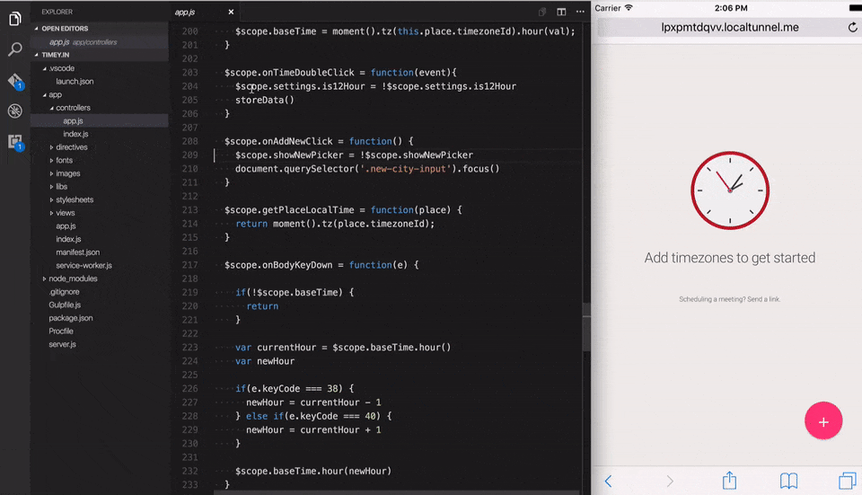

<h1 align="center">
  <br>
    
  <br>
  VS Code - Debugger for iOS Web
  <br>
  <br>
</h1>

<h4 align="center">Debug your JavaScript code running in Safari on iOS devices from VS Code.</h4>

<p align="center">
  <a href="https://travis-ci.com/Microsoft/vscode-ios-web-debug"></a>
  <a href="https://github.com/microsoft/vscode-ios-web-debug/releases"></a>
</p>

The VS Code iOS Web Debugger allows to debug your JavaScript code running in Safari on iOS devices (and iOS Simulators) from VS Code both on **Windows and Mac** without addtional tools.



**Supported features**
* Setting breakpoints, including in source files when source maps are enabled
* Stepping, including with the buttons on the Chrome page
* The Locals pane
* Debugging eval scripts, script tags, and scripts that are added dynamically
* Watches
* Console

**Unsupported scenarios**
* Debugging web workers
* Any features that aren't script debugging.

## Getting Started

Before you use the debugger you need to make sure you have the [latest version of iTunes](http://www.apple.com/itunes/download/) installed, as we need a few libraries provided by iTunes to talk to the iOS devices.

#### Windows
Nothing/ to do as there is a proxy included with the extension from the `vs-libimobile` npm package

#### OSX/Mac
Make sure you have Homebrew installed, and run the following command to install [ios-webkit-debug-proxy](https://github.com/google/ios-webkit-debug-proxy)

```
brew install ios-webkit-debug-proxy
````

## Using the debugger

When your launch config is set up, you can debug your project! Pick a launch config from the dropdown on the Debug pane in Code. Press the play button or F5 to start.

### Configuration 

The extension operates in two modes - it can `launch` a URL in Safari on the device, or it can `attach` to a running tab inside Safari. Just like when using the Node debugger, you configure these modes with a `.vscode/launch.json` file in the root directory of your project. You can create this file manually, or Code will create one for you if you try to run your project, and it doesn't exist yet.

To use this extension, you must first open the folder containing the project you want to work on.

#### Launch
Two example `launch.json` configs. You must specify either `file` or `url` to launch Chrome against a local file or a url. If you use a url, set `webRoot` to the directory that files are served from. This can be either an absolute path or a path relative to the workspace (the folder open in Code). It's used to resolve urls (like "http://localhost/app.js") to a file on disk (like "/users/me/project/app.js"), so be careful that it's set correctly.

```json
{
    "version": "0.1.0",
    "configurations": [
        {
            "name": "iOS - Launch localhost with sourcemaps",
            "type": "ios",
            "request": "launch",
            "port": 9222,
            "url": "http://dev.domain.com/",
            "webRoot": "${workspaceRoot}",
            "deviceName": "*",
            "sourceMaps": true
        },
        {
            "name": "iOS - Launch localhost with sourcemaps via Tunnel",
            "type": "ios",
            "request": "launch",
            "port": 9222,
            "webRoot": "${workspaceRoot}",
            "deviceName": "*",
            "sourceMaps": true,
            "tunnelPort": 8080
        }
    ]
}
```

#### Attach

Attach to an already running browser tab in Safari by using the `url` to match the correct tab

An example `launch.json` config.
```json
{
    "version": "0.1.0",
    "configurations": [
      {
          "name": "iOS - Attach",
          "type": "ios",
          "request": "attach",
          "port": 9222,
          "sourceMaps": true,
          "url": "http://dev.domain.com/",
          "webRoot": "${workspaceRoot}",
          "deviceName": "*"
      }
    ]
}
```

#### Other optional launch config fields
* `diagnosticLogging`: When true, the adapter logs its own diagnostic info to the console
* `deviceName`: The name of the devices, if multiple devices are connected. `*` matches any device.


## Troubleshooting
Please have a look at [vscode-chrome-debug-core](https://github.com/Microsoft/vscode-chrome-debug-core/) for additional troubleshooting and options.

===
This project has adopted the [Microsoft Open Source Code of Conduct](https://opensource.microsoft.com/codeofconduct/). For more information see the [Code of Conduct FAQ](https://opensource.microsoft.com/codeofconduct/faq/) or contact [opencode@microsoft.com](mailto:opencode@microsoft.com) with any additional questions or comments.
